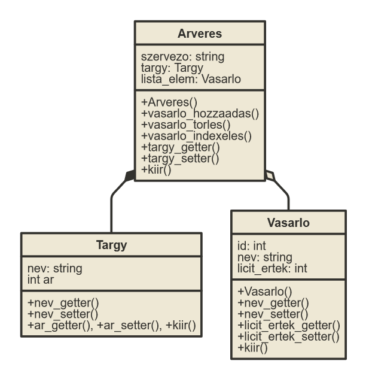

# Ponstositott Specifikáció

## Objektumok

### Árverés

#### Tulajdonságok

Tárgy, VásárlóLista

#### Public Funkciók

vásárló hozzáadás + : VásárlóLista végére fűz egy új vásárlót. Mivel addig megyünk a licitálásban amig mindenki ki nem szállt fölösleges máshová hozzáadnunk listaelemet. Ha csak stringet adunk meg készit egy új vásárlót. Az id mindig átiródik az aktuális utolsóhoz képest. Megadhatunk egy teljes VásárlóListát is, ezzel egyszerűbb ha több tárgyat akarunk árverezni, csak át kell adnunk az előző árverés VásárlóListáját.

vásárló törlés - : VásárlóListából kitörli az adott elemet név(string) szerint. Az indexek az előző állapotban maradnak.

vásárló indexelés [] : Ha egy Árverés objektumot indexelünk a VásárlóLista elemeit érjük el. Lehet név(string) vagy id alapján keresni. Hiányzó név vagy id esetén hibát dob vissza. Balértékként is lehet haszálni, a vásárló szerkesztésére.

tárgy hozzáadás : Getter és Setter.

kiir : Elinditja az árverést.

### Vásárló

#### Tulajdonságok

Id: Az adott árverésben lévő száma, mivel több embernek is ugyanaz lehet a neve.
Név: Fix hosszú char tömb.
LicitÉrték: A licitáláskor vett random számban játszik szerepet.

#### Public Funkciók

Név szerkesztés : Getter és Setter

Licitérték szerkesztés : Getter és Setter

kiir : Kiir egy vásárló példányt.

### Tárgy

#### Tulajdonságok

Név: Fix hosszú char tömb.
Ár: A licitáláshoz használt kezdőérték.

#### Public Funkciók

Ár szerkesztés : Getter és Setter

### Global funkciók

kiiras << : Kiirja az objektumokat. Árverés esetében elinditja az árverést. Template-ként van megirva, minden classnak meghivja a hozzátartozó függvényt.

Minden objektum kiirása és beolvasása operatorokkal. Getter és Setter függvények a paraméterekhez. Ha több tárgyat szeretnénk elárverezni, több Árverés objektum kell és ezeket egymás után kiirhatjuk. Minden objektumnak több konstruktora lesz, hogy előre megadott adatokkal feltölthessük.

