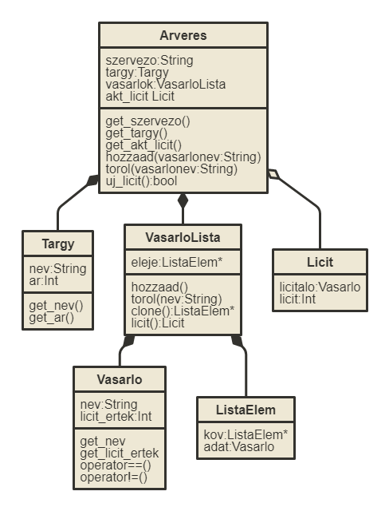

# Specifikáció

## Feladat

Egy digitális árverés szimulálása. Egy tárgyat lehet elárverezni vásárló-botok segitségével. Minden vásárló véletlenszerűen licitál az adott tárgyra. A szimuláció addig fut, amig van legalább 2 licitáló, ezután aki az utolsó licitet tette, megnyeri a tárgyat az adott áron. Nem lehet túl kevés vásárlóval elinditani az árverést.

## Árverés

Lehessen egy árveréshez tárgyat, vásárlókat és szervezőt hozzáadni. Ezeket bármikor lehet változtatni. Az utóbbit csak név alapján. Ha bármelyik hiányzik nem lehet az árverést elinditani. Hozzá lehet egysével, de teljes listaként is adni a vásárlókat. Értékek nélkül is létre lehet hozni, de ilyenkor utólag kell mindent megadni, nincsenek alapértékei. Ki is lehet törölni vásárlókat az árverésből név alapján.

## Vásárló

Van neve és licit értéke, amilyen eséllyel tud licitálni egy tárgyra. Létre lehet hozni név nélkül is, de ne lehessen elindítani, amíg nincs név megadva.

## Tárgy

Van neve és kezdőértéke, amiről indul a licitálása. Név nélkül nem lehet létrehozni, de van alap licit értéke.

Az alap operatorokkal lehessen a programot kezelni.

# Ponstositott Specifikáció

## Objektumok

### Licit

Ezzel tudnak az objektumok egymás között liciteket átadni, amivel a licitálót és a licit értékét is látjuk.

#### Tulajdonságok

Licitáló, licit

#### Public Funkciók

Konstruktor: létrehoz egy licitet, 0 licit értékkel.

### Árverés

Az árverés lebonyolítására szolgáló objektum. Nem lehet másoló konstruktort és egyenlőség opetárort használni.

#### Tulajdonságok

Szervező: Az árverés szervezőjének neve.
Tárgy: Az árverésen elárverezendő tárgy.
VásárlóLista: Az árveréshez tartozó vásárlók listája.
Licit: A legnagyobb érvényes licit.

#### Public Funkciók

Konstruktor: Meg kell adni a szervező nevét, és a tárgyat. Vásárlókat később lehet hozzáadni.

Szervező szerkesztés: Getter és Setter

Tárgy szerkesztés: Getter és Setter

Licit szerkesztés: Getter és Setter

Vásárló hozzáadása: Hozzáad egy vásárlót a listához, név alapján.

Vásárló törlése: Kitörli a megadott nevű játékost a listából.

Licitálás: Kezd egy új licitet, a kiírásnál lesz használva.

### Vásárló

#### Tulajdonságok

Név: Vásárló neve std:string-ként.
LicitÉrték: A licitáláskor vett random számban játszik szerepet, illetve a licitálás értékében.

#### Public Funkciók

Név szerkesztés : Getter és Setter

Licitérték szerkesztés : Getter és Setter

kiir : Kiir egy vásárló példányt.

Egyenlőség és nem egyenlőség operátorok: Két vásárló nevének összehasonlításához.

### Tárgy

#### Tulajdonságok

Név: Tárgy neve std:string-ként eltárolva.
Ár: A licitáláshoz használt kezdőérték.

#### Public Funkciók

Név szerkesztés: Getter és Setter

Ár szerkesztés : Getter és Setter

### VasarloLista

#### Tulajdonságok

Eleje: Láncolt lista, ezért az első elemet egy ListaElem struct-tal van eltárolva.

### Public funkciók

Hozzáadás: Új elem hozzáadása név, illetve vásárló alapján.

Törlés: Elem törlése név alapján.

Clone: Lista leklónozása, másoláshoz.

Licit: Egy licitkör megvalósítása. Az árverés futtatásakor van használva.

### Global funkciók

kiiras << : Kiirja az objektumokat. Árverés esetében elinditja az árverést. Minden classhoz megvan írva a kiírás operátor. Az árverés esetében ezzel lehet elindítani magát az árverést.

